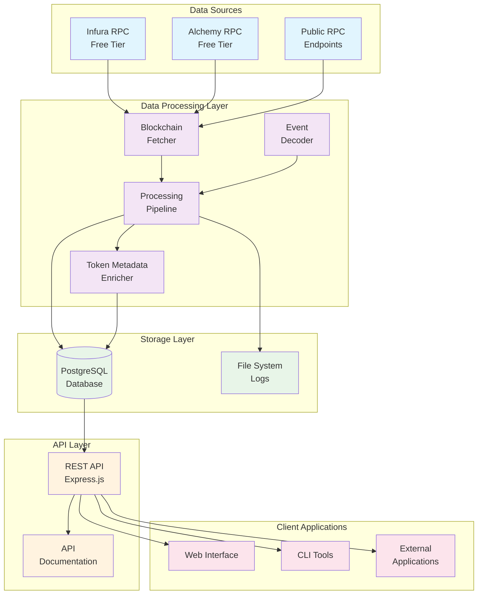
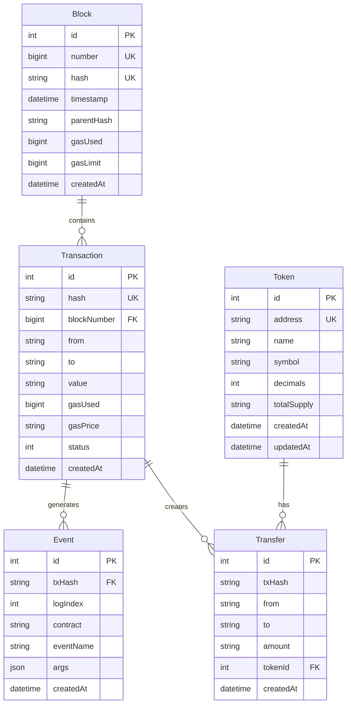
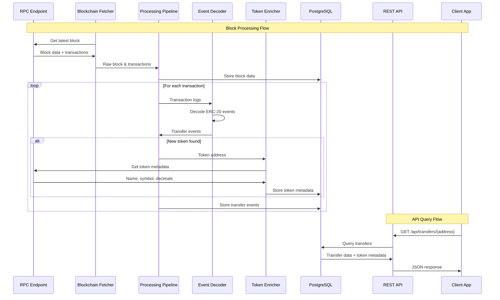

# Vibe Coding Your Way to Blockchain Data Processing: A Developer's Journey

*How I built a complete DeFi data platform PoC using AI-assisted development and free resources*

## Introduction

**Prompt for AI Assistant:**
> "Write an engaging introduction about the intersection of AI-assisted development and blockchain data processing. Explain what 'vibe coding' means in the context of building complex systems with AI help. Set the stage for building a DeFi data platform PoC using only free resources."

**Key Points to Cover:**
- What is vibe coding and why it's perfect for blockchain development
- The challenge: Building a DeFi data platform with zero budget
- The solution: AI-assisted development with free resources
- What readers will learn and build

---

## The Vision: What We're Building

**Prompt for AI Assistant:**
> "Create a compelling vision statement for a blockchain data processing platform. Explain the business value, technical challenges, and why this matters for the DeFi ecosystem. Include specific use cases and target audience."

### System Architecture Overview



**Prompt for AI Assistant:**
> "Explain this architecture diagram in simple terms. Break down each component and how they work together. Focus on the data flow and why we chose this specific architecture for a PoC."

---

## Week 1: Foundation Setup - The Vibe Begins

### Day 1-2: Environment Setup

**Prompt for AI Assistant:**
> "Write a step-by-step guide for setting up a Node.js blockchain development environment. Include all necessary dependencies, explain why each package is needed, and provide troubleshooting tips for common issues."

**Code Implementation:**

```bash
# Project structure setup
mkdir blockchain-poc
cd blockchain-poc
npm init -y
npm install typescript @types/node ts-node nodemon
npm install ethers prisma @prisma/client
npm install express @types/express cors dotenv
npm install -D @types/cors

# Docker setup
docker-compose up -d postgres
npx prisma init
npx prisma migrate dev --name init
```

**Prompt for AI Assistant:**
> "Explain each command in this setup sequence. What does each package do? Why do we need Docker for PostgreSQL? How does Prisma help with database management?"

### Day 3-4: Basic Blockchain Connection

**Prompt for AI Assistant:**
> "Create a comprehensive guide for connecting to Ethereum using ethers.js. Explain RPC endpoints, rate limiting, error handling, and best practices for blockchain interaction."

**Code Implementation:**

```typescript
// src/ingestion/blockchain-fetcher.ts
import { ethers } from 'ethers';

class BlockchainFetcher {
  private provider: ethers.Provider;
  
  constructor(rpcUrl: string) {
    this.provider = new ethers.JsonRpcProvider(rpcUrl);
  }
  
  async getLatestBlock(): Promise<ethers.Block> {
    return await this.provider.getBlock('latest', true);
  }
  
  async getBlockTransactions(blockNumber: number): Promise<ethers.TransactionResponse[]> {
    const block = await this.provider.getBlock(blockNumber, true);
    return block?.transactions || [];
  }
}
```

**Prompt for AI Assistant:**
> "Explain this BlockchainFetcher class. How does ethers.js work? What's the difference between getBlock with and without transactions? How would you add error handling and retry logic?"

### Day 5: Database Schema Design

**Prompt for AI Assistant:**
> "Design a database schema for blockchain data. Explain the relationships between blocks, transactions, events, tokens, and transfers. Why do we need each table? How do we handle the hierarchical nature of blockchain data?"

**Database Schema:**



**Prisma Schema:**

```sql
-- prisma/schema.prisma
model Block {
  id          Int      @id @default(autoincrement())
  number      BigInt   @unique
  hash        String   @unique
  timestamp   DateTime
  parentHash  String
  gasUsed     BigInt
  gasLimit    BigInt
  createdAt   DateTime @default(now())
  
  transactions Transaction[]
}

model Transaction {
  id          Int      @id @default(autoincrement())
  hash        String   @unique
  blockNumber BigInt
  from        String
  to          String?
  value       String
  gasUsed     BigInt
  gasPrice    String
  status      Int
  createdAt   DateTime @default(now())
  
  block       Block    @relation(fields: [blockNumber], references: [number])
  events      Event[]
}

model Event {
  id            Int      @id @default(autoincrement())
  txHash        String
  logIndex      Int
  contract      String
  eventName     String
  args          Json
  createdAt     DateTime @default(now())
  
  transaction   Transaction @relation(fields: [txHash], references: [hash])
  
  @@unique([txHash, logIndex])
}

model Token {
  id          Int      @id @default(autoincrement())
  address     String   @unique
  name        String?
  symbol      String?
  decimals    Int?
  totalSupply String?
  createdAt   DateTime @default(now())
  updatedAt   DateTime @updatedAt
  
  transfers   Transfer[]
}

model Transfer {
  id        Int      @id @default(autoincrement())
  txHash    String
  from      String
  to        String
  amount    String
  tokenId   Int
  createdAt DateTime @default(now())
  
  token     Token    @relation(fields: [tokenId], references: [id])
}
```

**Prompt for AI Assistant:**
> "Explain this database schema design. Why do we separate events from transfers? How do we handle the relationship between transactions and events? What are the performance implications of this design?"

---

## Week 2: Core Processing - The Magic Happens

### Day 1-2: Event Decoding

**Prompt for AI Assistant:**
> "Explain how Ethereum event decoding works. What are ABIs? How do we decode ERC-20 Transfer events? What challenges do we face with different token standards?"

**Code Implementation:**

```typescript
// src/processing/event-decoder.ts
import { ethers } from 'ethers';

class EventDecoder {
  private erc20Abi = [
    "event Transfer(address indexed from, address indexed to, uint256 value)"
  ];
  
  decodeTransferEvent(log: ethers.Log): TransferEvent | null {
    try {
      const iface = new ethers.Interface(this.erc20Abi);
      const decoded = iface.parseLog(log);
      
      if (decoded?.name === 'Transfer') {
        return {
          from: decoded.args.from,
          to: decoded.args.to,
          amount: decoded.args.value.toString(),
          contract: log.address
        };
      }
    } catch (error) {
      console.error('Failed to decode transfer event:', error);
    }
    
    return null;
  }
}
```

**Prompt for AI Assistant:**
> "Break down this event decoding code. How does ethers.js parse logs? What happens when decoding fails? How would you extend this to support other event types like Approval or Swap events?"

### Day 3-4: Data Processing Pipeline

**Prompt for AI Assistant:**
> "Design a data processing pipeline for blockchain data. Explain the flow from raw blocks to processed events. How do we handle errors, retries, and data consistency?"

**Data Flow Diagram:**



**Code Implementation:**

```typescript
// src/processing/pipeline.ts
class ProcessingPipeline {
  private fetcher: BlockchainFetcher;
  private decoder: EventDecoder;
  private db: PrismaClient;
  
  async processLatestBlocks(count: number = 10): Promise<void> {
    const latestBlock = await this.fetcher.getLatestBlock();
    
    for (let i = 0; i < count; i++) {
      const blockNumber = latestBlock.number - BigInt(i);
      await this.processBlock(blockNumber);
    }
  }
  
  private async processBlock(blockNumber: bigint): Promise<void> {
    // Fetch block data
    const block = await this.fetcher.getBlock(blockNumber);
    const transactions = await this.fetcher.getBlockTransactions(Number(blockNumber));
    
    // Store block
    await this.db.block.upsert({
      where: { number: blockNumber },
      update: {},
      create: {
        number: blockNumber,
        hash: block.hash,
        timestamp: new Date(block.timestamp * 1000),
        parentHash: block.parentHash,
        gasUsed: block.gasUsed,
        gasLimit: block.gasLimit
      }
    });
    
    // Process transactions
    for (const tx of transactions) {
      await this.processTransaction(tx);
    }
  }
}
```

**Prompt for AI Assistant:**
> "Explain this processing pipeline. How do we handle block processing? What's the purpose of upsert operations? How would you add error handling and retry logic?"

### Day 5: Basic API Development

**Prompt for AI Assistant:**
> "Create a REST API for blockchain data. Design endpoints for querying transfers, tokens, and transactions. Include pagination, filtering, and error handling."

**Code Implementation:**

```typescript
// src/api/server.ts
import express from 'express';
import { PrismaClient } from '@prisma/client';

const app = express();
const db = new PrismaClient();

app.get('/api/transfers/:address', async (req, res) => {
  const { address } = req.params;
  const { page = 1, limit = 10 } = req.query;
  
  const transfers = await db.transfer.findMany({
    where: {
      OR: [
        { from: address },
        { to: address }
      ]
    },
    include: {
      token: true
    },
    skip: (Number(page) - 1) * Number(limit),
    take: Number(limit),
    orderBy: { createdAt: 'desc' }
  });
  
  res.json(transfers);
});

app.get('/api/tokens', async (req, res) => {
  const tokens = await db.token.findMany({
    orderBy: { createdAt: 'desc' }
  });
  
  res.json(tokens);
});

app.listen(3000, () => {
  console.log('API server running on port 3000');
});
```

**Prompt for AI Assistant:**
> "Explain this API implementation. How does the transfer query work? What's the purpose of the include statement? How would you add input validation and error handling?"

---

## Week 3: Enhancement & Testing - Bringing It All Together

### Day 1-2: Token Metadata Enrichment

**Prompt for AI Assistant:**
> "Implement token metadata enrichment. Explain how to fetch token information from smart contracts. Handle errors gracefully and implement caching strategies."

**Code Implementation:**

```typescript
// src/enrichment/token-metadata.ts
class TokenMetadataEnricher {
  private provider: ethers.Provider;
  
  async enrichToken(address: string): Promise<TokenMetadata> {
    const contract = new ethers.Contract(address, [
      'function name() view returns (string)',
      'function symbol() view returns (string)',
      'function decimals() view returns (uint8)',
      'function totalSupply() view returns (uint256)'
    ], this.provider);
    
    try {
      const [name, symbol, decimals, totalSupply] = await Promise.all([
        contract.name(),
        contract.symbol(),
        contract.decimals(),
        contract.totalSupply()
      ]);
      
      return {
        address,
        name,
        symbol,
        decimals,
        totalSupply: totalSupply.toString()
      };
    } catch (error) {
      console.error(`Failed to fetch metadata for token ${address}:`, error);
      return {
        address,
        name: 'Unknown',
        symbol: 'UNK',
        decimals: 18,
        totalSupply: '0'
      };
    }
  }
}
```

**Prompt for AI Assistant:**
> "Explain this token enrichment process. Why do we use Promise.all? How do we handle failed metadata fetches? What are the performance implications of this approach?"

### Day 3-4: Testing & Validation

**Prompt for AI Assistant:**
> "Write comprehensive tests for the blockchain data processing system. Include unit tests, integration tests, and API tests. Explain testing strategies for blockchain applications."

**Code Implementation:**

```typescript
// tests/integration.test.ts
import { describe, it, expect } from '@jest/globals';

describe('Blockchain Data Processing PoC', () => {
  it('should fetch and store blocks', async () => {
    const fetcher = new BlockchainFetcher(process.env.ETH_RPC_URL!);
    const block = await fetcher.getLatestBlock();
    
    expect(block).toBeDefined();
    expect(block.number).toBeGreaterThan(0);
  });
  
  it('should decode ERC-20 transfer events', async () => {
    const decoder = new EventDecoder();
    const mockLog = {
      address: '0xA0b86a33E6441c8C4C4C4C4C4C4C4C4C4C4C4C4C',
      topics: ['0xddf252ad1be2c89b69c2b068fc378daa952ba7f163c4a11628f55a4df523b3ef'],
      data: '0x0000000000000000000000000000000000000000000000000000000000000001'
    };
    
    const decoded = decoder.decodeTransferEvent(mockLog);
    expect(decoded).toBeDefined();
    expect(decoded?.amount).toBe('1');
  });
  
  it('should provide API endpoints', async () => {
    const response = await fetch('http://localhost:3000/api/tokens');
    expect(response.status).toBe(200);
    
    const tokens = await response.json();
    expect(Array.isArray(tokens)).toBe(true);
  });
});
```

**Prompt for AI Assistant:**
> "Explain these test cases. How do we test blockchain interactions? What are the challenges of testing with real blockchain data? How would you add more comprehensive test coverage?"

### Day 5: Documentation & Demo

**Prompt for AI Assistant:**
> "Create comprehensive documentation for the blockchain data processing PoC. Include setup instructions, API documentation, and troubleshooting guides."

---

## Free Resources Configuration - Making It Work on a Budget

### Ethereum RPC Endpoints

**Prompt for AI Assistant:**
> "Research and document free Ethereum RPC endpoints. Explain rate limits, reliability, and best practices for using free services in production."

**Configuration:**

```typescript
// config/rpc-endpoints.ts
export const RPC_ENDPOINTS = {
  // Free tier limits: 100k requests/day
  infura: 'https://mainnet.infura.io/v3/YOUR_PROJECT_ID',
  
  // Free tier limits: 300M requests/month
  alchemy: 'https://eth-mainnet.g.alchemy.com/v2/YOUR_API_KEY',
  
  // Public endpoints (unreliable but free)
  public: [
    'https://cloudflare-eth.com',
    'https://rpc.ankr.com/eth',
    'https://ethereum.publicnode.com'
  ]
};
```

### Docker Setup

**Prompt for AI Assistant:**
> "Create a Docker Compose setup for the blockchain data processing system. Include PostgreSQL, Redis for caching, and monitoring services."

**Docker Configuration:**

```yaml
# docker-compose.yml
version: '3.8'
services:
  postgres:
    image: postgres:15
    environment:
      POSTGRES_DB: blockchain_poc
      POSTGRES_USER: postgres
      POSTGRES_PASSWORD: password
    ports:
      - "5432:5432"
    volumes:
      - postgres_data:/var/lib/postgresql/data

volumes:
  postgres_data:
```

---

## Lessons Learned - The Vibe Coding Journey

**Prompt for AI Assistant:**
> "Reflect on the journey of building a blockchain data processing system with AI assistance. What worked well? What were the challenges? How did vibe coding change the development process?"

### What Worked Well
- AI-assisted code generation and explanation
- Iterative development with immediate feedback
- Free resource utilization
- Clear separation of concerns

### Challenges Faced
- RPC rate limiting and reliability
- Complex blockchain data structures
- Error handling in distributed systems
- Performance optimization

### Vibe Coding Insights
- How AI changed the development workflow
- The importance of clear prompts
- Balancing automation with understanding
- Building complex systems iteratively

---

## Next Steps - Scaling the Vibe

**Prompt for AI Assistant:**
> "Outline the next steps for scaling this blockchain data processing system. What would you add for production? How would you handle multi-chain support? What are the performance considerations?"

### Production Considerations
- Message queues (Kafka/Redis)
- Multi-chain support
- Real-time processing
- Advanced analytics
- Monitoring and alerting

### Performance Optimization
- Database indexing
- Caching strategies
- Parallel processing
- Resource optimization

---

## Conclusion

**Prompt for AI Assistant:**
> "Write a compelling conclusion that ties together the vibe coding journey, the technical achievements, and the future potential of AI-assisted blockchain development."

**Key Takeaways:**
- Vibe coding enables rapid prototyping of complex systems
- Free resources can power significant blockchain applications
- AI assistance accelerates development without sacrificing quality
- The future of blockchain development is collaborative (human + AI)

---

## Resources & Links

**Prompt for AI Assistant:**
> "Compile a comprehensive list of resources for blockchain data processing, including documentation, tools, free services, and learning materials."

### Documentation
- [Ethers.js Documentation](https://docs.ethers.org/)
- [Prisma Documentation](https://www.prisma.io/docs/)
- [PostgreSQL Documentation](https://www.postgresql.org/docs/)

### Free Services
- [Infura Free Tier](https://infura.io/)
- [Alchemy Free Tier](https://www.alchemy.com/)
- [Public RPC Endpoints](https://ethereum.org/en/developers/docs/nodes-and-clients/)

### Tools & Libraries
- [Node.js](https://nodejs.org/)
- [TypeScript](https://www.typescriptlang.org/)
- [Docker](https://www.docker.com/)
- [Express.js](https://expressjs.com/)

---

**About the Author:**
*[Your bio and contact information]*

**Tags:** #Blockchain #DeFi #DataProcessing #AIAssistedDevelopment #VibeCoding #NodeJS #Ethereum #Web3

---

*This article demonstrates how AI-assisted development can accelerate blockchain application development while maintaining code quality and understanding. The complete source code and documentation are available in the accompanying repository.*
