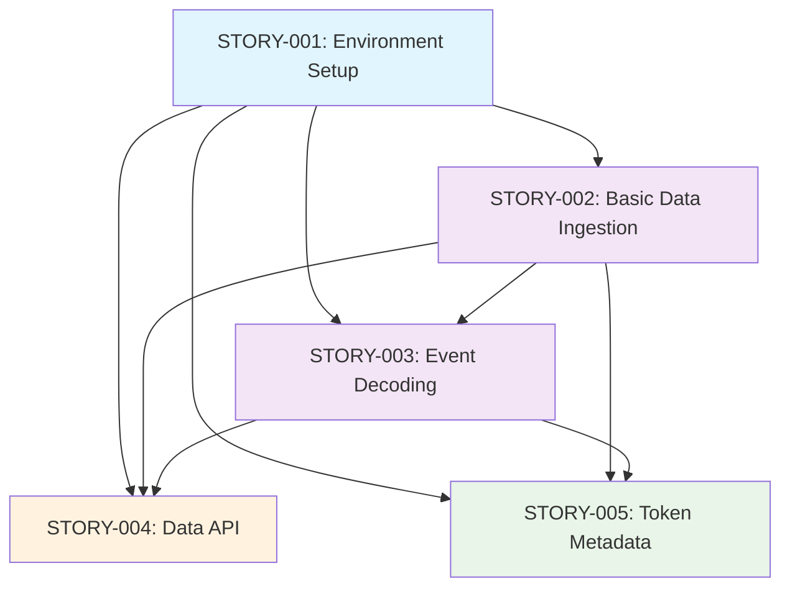

# Epic 001: PoC Foundation - User Stories

This directory contains the detailed user stories for **EPIC-001: PoC Foundation - Blockchain Data Processing**. Each story is designed to be implementable in 1-2 days and includes comprehensive technical specifications, acceptance criteria, and implementation details.

## Story Overview

| Story ID | Title | Priority | Story Points | Sprint | Dependencies |
|----------|-------|----------|--------------|--------|--------------|
| [STORY-001](./story-001-environment-setup.md) | Environment Setup | High | 5 | Week 1, Day 1-2 | None |
| [STORY-002](./story-002-basic-data-ingestion.md) | Basic Data Ingestion | High | 8 | Week 1, Day 3-4 | STORY-001 |
| [STORY-003](./story-003-event-decoding.md) | Event Decoding | High | 8 | Week 2, Day 1-2 | STORY-001, STORY-002 |
| [STORY-004](./story-004-data-api.md) | Data API | High | 5 | Week 2, Day 5 | STORY-001, STORY-002, STORY-003 |
| [STORY-005](./story-005-token-metadata.md) | Token Metadata | Medium | 5 | Week 3, Day 1-2 | STORY-001, STORY-002, STORY-003 |

## Epic Summary

**Goal**: Create a proof-of-concept blockchain data processing system using only free resources to demonstrate the feasibility of building a DeFi data platform.

**Duration**: 2-3 weeks  
**Complexity**: Low  
**Phase**: PoC  

## Story Dependencies

## Implementation Timeline

### Week 1: Foundation
- **Day 1-2**: STORY-001 (Environment Setup)
- **Day 3-4**: STORY-002 (Basic Data Ingestion)

### Week 2: Core Processing
- **Day 1-2**: STORY-003 (Event Decoding)
- **Day 5**: STORY-004 (Data API)

### Week 3: Enhancement
- **Day 1-2**: STORY-005 (Token Metadata)

## Technical Stack

Each story uses the following technology stack:

- **Backend**: Node.js + TypeScript
- **Blockchain**: ethers.js
- **Database**: PostgreSQL + Prisma ORM
- **API**: Express.js
- **Containerization**: Docker + Docker Compose
- **Testing**: Jest
- **Validation**: Zod

## Free Resources

All stories are designed to work with free resources:

- **Ethereum RPC**: Infura free tier, Alchemy free tier, public endpoints
- **Database**: Local PostgreSQL via Docker
- **Storage**: Local filesystem
- **Development**: Docker, Node.js, TypeScript

## Success Criteria

### Functional Requirements
- [ ] Successfully fetch blocks from Ethereum mainnet
- [ ] Decode ERC-20 Transfer events correctly
- [ ] Store processed data in PostgreSQL
- [ ] Provide REST API for querying data
- [ ] Enrich tokens with name, symbol, decimals
- [ ] Handle RPC failures and missing data gracefully

### Non-Functional Requirements
- [ ] Process at least 100 blocks without errors
- [ ] Handle RPC rate limits and timeouts
- [ ] Complete setup documentation
- [ ] Clean, documented code
- [ ] Basic test coverage

### Demo Requirements
- [ ] Show real-time data processing
- [ ] Demonstrate API endpoints with real data
- [ ] 15-minute presentation showing capabilities
- [ ] Complete setup and architecture docs

## Getting Started

1. **Start with STORY-001**: Set up the development environment
2. **Follow dependencies**: Each story builds on previous ones
3. **Test thoroughly**: Each story includes comprehensive testing
4. **Document progress**: Update acceptance criteria as you complete tasks

## Story Structure

Each story follows this structure:

- **Story Information**: ID, priority, story points, sprint
- **User Story**: As a... I want... So that...
- **Acceptance Criteria**: Functional and technical requirements
- **Implementation Details**: Code examples and technical specifications
- **Definition of Done**: Code quality, testing, performance, documentation
- **Testing Strategy**: Unit tests, integration tests, test examples
- **Dependencies**: External and internal dependencies
- **Risks and Mitigation**: Risk assessment and mitigation strategies
- **Notes**: Additional considerations and best practices

## Development Guidelines

### Code Quality
- Follow TypeScript best practices
- Implement proper error handling
- Use JSDoc for documentation
- No console.log in production code

### Testing
- Write unit tests for all classes
- Include integration tests for workflows
- Test error handling scenarios
- Maintain test coverage

### Performance
- Implement caching where appropriate
- Handle rate limits gracefully
- Process data efficiently
- Monitor memory usage

### Documentation
- Document all public APIs
- Include setup instructions
- Provide troubleshooting guides
- Update as you develop

## Next Steps

After completing all stories in this epic:

1. **Gather feedback** from demo
2. **Identify areas for improvement**
3. **Plan Epic 002** (Core Decoding) based on learnings
4. **Consider scaling** to production resources if PoC is successful

## Related Documents

- [Epic 001: PoC Foundation](../processing_epics/epic-001-poc-foundation.md)
- [Processing Layer Architecture](../processing_layer_architecture.md)
- [Processing Layer PRD](../processing_layer_prd.md)
- [Ethereum Free RPC Spec](../ethereum_free_rpc_spec.md)

---

**Total Estimated Effort**: 2-3 weeks  
**Team Size**: 1-2 developers  
**Priority**: High (Foundation for all other epics)
